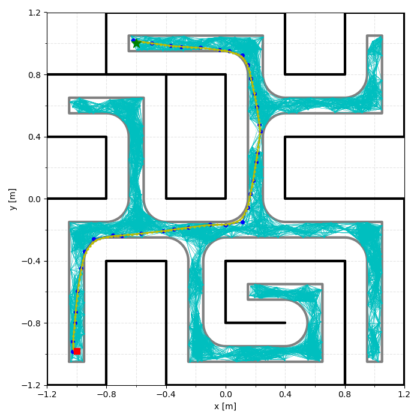
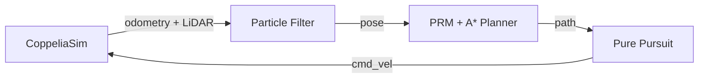

# Autonomous Robot Navigation & Localization

Autonomous mobile-robot navigation stack built with **ROS 2** and **CoppeliaSim**, combining particle-filter localization, LiDAR perception, PRM/A* path planning, and pure-pursuit control for a simulated TurtleBot3 Burger.



## What it does
- **Global localization** via particle filter with DBSCAN-based pose clustering from noisy odometry + LiDAR
- **Path planning** using a Probabilistic Roadmap (PRM) with A* search and path smoothing
- **Motion control** via a Pure Pursuit controller, with a reactive Wall Follower during localization
- **ROS 2 lifecycle management** to configure/activate nodes in a deterministic order

## Tech stack
Python · ROS 2 Humble · CoppeliaSim · NumPy · SciPy · scikit-learn · Docker

## Architecture



## Run it

```bash
git clone https://github.com/inigoserrano/autonomous-robot-navigation.git
cd autonomous-robot-navigation
# Open in VS Code -> "Dev Containers: Reopen in Container"
colcon build && source install/setup.bash
ros2 launch amr_bringup project.launch.py
```
Requires Docker, VS Code + Dev Containers extension, and CoppeliaSim on the host.

📄 Full architecture, algorithms, and configuration details: [`docs/ARCHITECTURE.md`](docs/ARCHITECTURE.md)

---
Team project — Universidad Pontificia Comillas (ICAI). I contributed across implementation, integration, testing, and debugging of the localization, planning, control, and simulation workflow.
