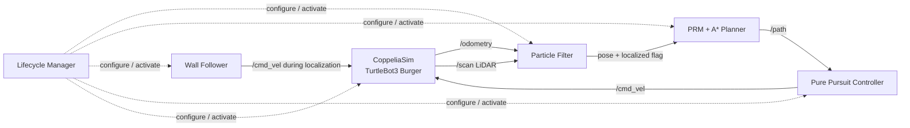

# Autonomous Robot Navigation & Localization

Autonomous mobile-robot navigation stack built with **ROS 2** and **CoppeliaSim**. The system combines global localization with a particle filter, LiDAR-based sensing, DBSCAN pose estimation, probabilistic-roadmap planning, A* search, path smoothing, and closed-loop motion control for a simulated TurtleBot3 Burger.

The project is organized as a set of ROS 2 lifecycle nodes so that localization, planning, control, and simulation can be configured and activated in a deterministic order.

## Demo

### Global localization

The particle filter starts with particles distributed throughout the free space when global localization is enabled.


As odometry and LiDAR measurements are processed, the distribution converges and DBSCAN is used to determine when a reliable pose estimate can be extracted.


### Path planning

Once the robot is localized, the planning node computes a collision-free route to the goal using a **Probabilistic Roadmap (PRM)** and **A\***, then smooths the resulting path before publishing it to the controller.


> A short CoppeliaSim GIF/video showing the complete navigation sequence can be added here once recorded.

## System Architecture



## Key Features

- **Particle-filter localization** using noisy odometry and LiDAR observations.
- **Global localization** with configurable particle count and motion/sensor noise.
- **DBSCAN-based pose estimation** to identify a consistent particle cluster before declaring the robot localized.
- **Probabilistic Roadmap (PRM)** generation with collision checking against the environment map.
- **A\* shortest-path search** from the localized robot pose to a configurable goal.
- **Path smoothing** after graph search to produce a more suitable trajectory for control.
- **Pure Pursuit** path-following controller with configurable look-ahead distance.
- **Wall-following controller** used as part of the navigation/localization behavior.
- **CoppeliaSim integration** for TurtleBot3 Burger motion, encoders, LiDAR, and simulation stepping.
- **ROS 2 lifecycle management** for ordered node configuration and activation.

## Navigation Pipeline

### 1. Perception and Simulation

`amr_simulation` interfaces ROS 2 with CoppeliaSim. The simulated TurtleBot3 Burger publishes:

- odometry on `/odometry`
- LiDAR measurements on `/scan`

and receives velocity commands through `/cmd_vel`.

### 2. Localization

`amr_localization` implements a particle filter. Each iteration uses the robot's measured linear/angular velocity for the motion update and LiDAR ranges for the measurement update.

The localization module:

1. initializes a particle population over the map,
2. propagates particles according to the motion model,
3. weights/resamples them using LiDAR observations,
4. clusters particles with **DBSCAN**, and
5. publishes the estimated pose once the particle distribution is sufficiently consistent.

### 3. Path Planning

`amr_planning` constructs a **Probabilistic Roadmap** from collision-free samples of the map. Once a localized pose is received, the planner:

1. connects the start and goal to the roadmap,
2. finds the shortest route with **A\***,
3. smooths the waypoint sequence, and
4. publishes the resulting `nav_msgs/Path` on `/path`.

The final launch configuration uses **1,000 roadmap nodes**, a **0.15 m connection distance**, and a **0.15 m obstacle safety distance**.

### 4. Motion Control

`amr_control` contains two controllers:

- **Wall Follower** — reactive controller based on range measurements.
- **Pure Pursuit** — follows the planned path using a configurable look-ahead point.

The final project configuration uses a **0.20 m Pure Pursuit look-ahead distance**.

### 5. Lifecycle Coordination

`amr_bringup` provides the launch files and a lifecycle manager. For the final project, nodes are configured and activated in the following order:

1. `particle_filter`
2. `probabilistic_roadmap`
3. `wall_follower`
4. `pure_pursuit`
5. `coppeliasim`

This ensures that the navigation stack is ready before the simulator begins the experiment.

## Project Structure

```text
autonomous-robot-navigation/
├── .devcontainer/              # Reproducible ROS 2 Humble development environment
├── src/
│   ├── amr_bringup/            # Launch files and lifecycle manager
│   ├── amr_control/            # Wall Follower and Pure Pursuit controllers
│   ├── amr_localization/       # Particle filter, DBSCAN localization and maps
│   ├── amr_msgs/               # Custom ROS 2 message definitions
│   ├── amr_planning/           # PRM, A* search, collision checking and smoothing
│   └── amr_simulation/         # CoppeliaSim/TurtleBot3 integration and worlds
├── docs/
│   └── images/                 # Selected portfolio/demo images
└── README.md
```

## Tech Stack

**Core:** Python, ROS 2 Humble, CoppeliaSim  
**Algorithms:** Particle Filter, DBSCAN, PRM, A*, Pure Pursuit  
**Scientific Computing:** NumPy, SciPy, scikit-learn, Shapely, Numba  
**Environment:** Docker, VS Code Dev Containers

## Getting Started

### Prerequisites

Install:

- [Docker](https://www.docker.com/)
- [Visual Studio Code](https://code.visualstudio.com/)
- the **Dev Containers** VS Code extension
- [CoppeliaSim](https://www.coppeliarobotics.com/)

The repository includes a devcontainer based on `osrf/ros:humble-desktop` with the project's Python dependencies installed automatically.

### 1. Clone the repository

```bash
git clone https://github.com/YOUR-USERNAME/autonomous-robot-navigation.git
cd autonomous-robot-navigation
```

### 2. Open the ROS environment

Open the repository in VS Code and run:

```text
Dev Containers: Reopen in Container
```

from the Command Palette (`Cmd/Ctrl + Shift + P`).

Once the container is ready, open a new VS Code terminal.

### 3. Build the ROS 2 workspace

From the repository root:

```bash
colcon build
source install/setup.bash
```

If you open a new terminal after building, run the `source` command again before launching the project.

### 4. Open the CoppeliaSim world

Start CoppeliaSim on the host machine and open:

```text
src/amr_simulation/worlds/project.ttt
```

Keep CoppeliaSim running while launching the ROS 2 stack.

### 5. Launch the complete project

```bash
ros2 launch amr_bringup project.launch.py
```

The launch file starts the localization, planning, control, simulation, and lifecycle-management nodes for the final navigation scenario.

## Final Project Configuration

The included `project.launch.py` currently defines:

| Parameter | Value |
|---|---:|
| Simulation world | `project` |
| Start pose | `(1.0, -1.0, 270°)` |
| Goal | `(0.2, -0.6)` |
| Particle count | `2000` |
| Global localization | `True` |
| PRM node count | `1000` |
| PRM connection distance | `0.15 m` |
| Obstacle safety distance | `0.15 m` |
| Pure Pursuit look-ahead | `0.20 m` |

Plot generation is disabled by default in the final launch file (`enable_plot: False`). It can be enabled in the localization/planning node parameters when generating diagnostic figures for a demo.

## Additional Launch Files

The repository also contains earlier laboratory launch configurations:

```bash
ros2 launch amr_bringup lab02.launch.py
ros2 launch amr_bringup lab03.launch.py
ros2 launch amr_bringup lab04.launch.py
```

The final integrated navigation scenario is launched with `project.launch.py`.

## Future Improvements

Potential extensions that would make the project stronger as an engineering portfolio piece include:

- automated navigation evaluation across multiple start/goal configurations,
- localization-error and time-to-goal metrics,
- path-length and success-rate benchmarking,
- automated tests for planning and localization edge cases,
- a reproducible end-to-end simulation demo recorded as a GIF/video.

## Team Project & Contribution

This project was developed collaboratively as part of robotics coursework at **Universidad Pontificia Comillas (ICAI)**. I contributed across the project lifecycle, including implementation, integration, testing, debugging, and the development of the localization, planning, control, and simulation workflow.

Course assignment PDFs and instructor-provided materials are intentionally not included in this public portfolio version.

---

If you use this repository as a portfolio project, replace `YOUR-USERNAME` in the clone URL and add a short CoppeliaSim demo near the top of the README before publishing.
